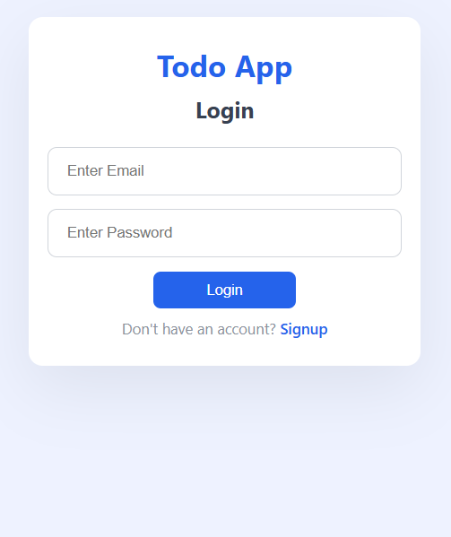
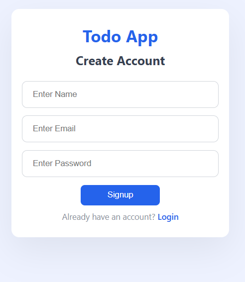
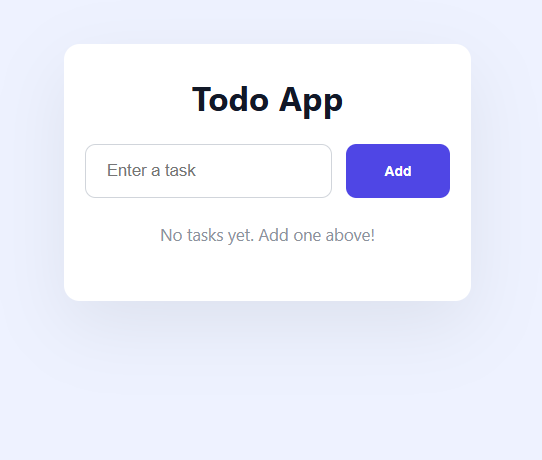

# MERN Todo App with JWT Authentication

A full-stack Todo Application built using the MERN Stack (MongoDB, Express.js, React.js, and Node.js). The application allows users to create an account, securely log in using JSON Web Tokens (JWT), and manage their own personal tasks. Each user can only access, create, update, and delete their own tasks.

---

## Screenshots

### Login Page



### Signup Page



### Todo Dashboard



---

## Table of Contents

- [Features](#features)
- [Technologies Used](#technologies-used)
- [Project Structure](#project-structure)
- [Authentication Flow](#authentication-flow)
- [REST API Endpoints](#rest-api-endpoints)
- [Installation](#installation)
- [How It Works](#how-it-works)
- [Application Architecture](#application-architecture)
- [Future Improvements](#future-improvements)
- [Author](#author)

---

## Features

- User Signup
- User Login
- JWT Authentication
- Protected Routes
- User-specific Tasks
- Add New Tasks
- View Personal Tasks
- Update Existing Tasks
- Delete Tasks
- Mark Tasks as Completed/Incomplete
- Password Encryption using bcryptjs
- Persistent Data Storage using MongoDB
- RESTful API Integration
- Responsive User Interface

---

## Technologies Used

### Frontend

- React.js
- JavaScript (ES6)
- Axios
- CSS3

### Backend

- Node.js
- Express.js
- JSON Web Token (JWT)
- bcryptjs

### Database

- MongoDB
- Mongoose

### Development Tools

- Git
- GitHub
- Postman
- MongoDB Compass

---

## Project Structure

```text
todo-react-app/
│
├── public/
│
├── screenshots/
│   ├── login.png
│   ├── signup.png
│   └── todo.png
│
├── src/
│   ├── components/
│   │   ├── Header.js
│   │   ├── Login.js
│   │   ├── Signup.js
│   │   ├── TodoInput.js
│   │   ├── TodoItem.js
│   │   └── TodoList.js
│   │
│   ├── services/
│   │   ├── authService.js
│   │   └── taskService.js
│   │
│   ├── App.js
│   ├── App.css
│   └── index.js
│
├── server/
│   ├── config/
│   ├── controllers/
│   │   ├── authController.js
│   │   └── taskController.js
│   │
│   ├── middleware/
│   │   └── authMiddleware.js
│   │
│   ├── models/
│   │   ├── user.js
│   │   └── Task.js
│   │
│   ├── routes/
│   │   ├── authRoutes.js
│   │   └── taskRoutes.js
│   │
│   ├── utils/
│   ├── package.json
│   └── server.js
│
├── package.json
└── README.md
```

---

## Authentication Flow

1. A new user registers using the Signup page.
2. The password is securely hashed using bcryptjs before being stored in MongoDB.
3. The user logs in using their email and password.
4. The server verifies the credentials.
5. A JWT token is generated.
6. The token is stored in the browser's Local Storage.
7. Every protected request sends the token in the Authorization header.
8. The backend verifies the token before processing the request.
9. Each user can only access their own tasks.

---

## REST API Endpoints

### Authentication APIs

| Method | Endpoint           | Description            |
| ------ | ------------------ | ---------------------- |
| POST   | `/api/auth/signup` | Register a new user    |
| POST   | `/api/auth/login`  | Login an existing user |

### Task APIs

| Method | Endpoint         | Description                     |
| ------ | ---------------- | ------------------------------- |
| GET    | `/api/tasks`     | Retrieve logged-in user's tasks |
| POST   | `/api/tasks`     | Create a new task               |
| PUT    | `/api/tasks/:id` | Update a task                   |
| DELETE | `/api/tasks/:id` | Delete a task                   |

---

## Installation

### 1. Clone the Repository

```bash
git clone https://github.com/abdullahsafdar-max/Todo-react-App.git
```

### 2. Navigate to the Project

```bash
cd Todo-react-App
```

### 3. Install Frontend Dependencies

```bash
npm install
```

### 4. Install Backend Dependencies

```bash
cd server
npm install
```

### 5. Configure Environment Variables

Create a `.env` file inside the `server` folder.

```env
PORT=5000
MONGO_URI=your_mongodb_connection_string
JWT_SECRET=your_secret_key
```

### 6. Start the Backend

```bash
cd server
npm run dev
```

### 7. Start the Frontend

Open another terminal.

```bash
npm start
```

---

## How It Works

1. Users create an account using the Signup page.
2. Users log in using their credentials.
3. The backend generates a JWT after successful authentication.
4. The frontend stores the JWT in Local Storage.
5. Every request includes the JWT in the Authorization header.
6. The backend validates the JWT before allowing access.
7. Authenticated users can manage only their own tasks.

---

## Application Architecture

```text
React Frontend
       │
     Axios
       │
Authorization Header (JWT)
       │
Express.js API
       │
Authentication Middleware
       │
Controllers
       │
Mongoose
       │
MongoDB
```

---

## Future Improvements

- Forgot Password
- Email Verification
- Task Categories
- Task Priority
- Due Dates
- Search Tasks
- Filter Tasks
- Dark Mode
- Deploy Backend and Frontend

---

## Author

**Abdullah Safdar**

🎓 BS Business Analytics Student

🌐 GitHub:
https://github.com/abdullahsafdar-max
